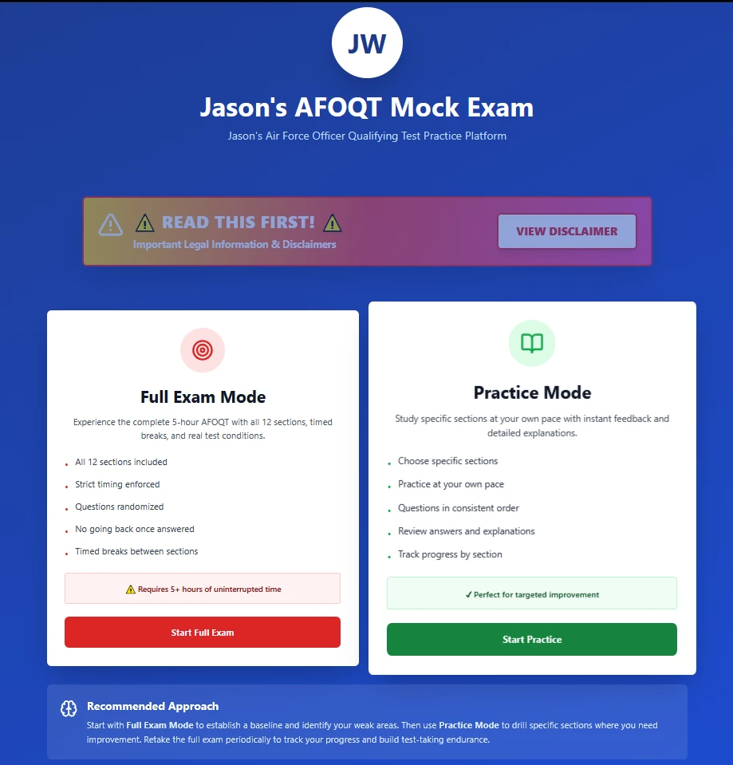
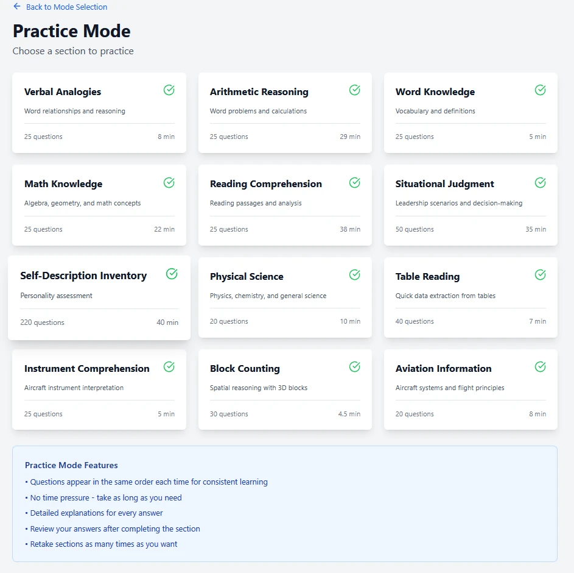
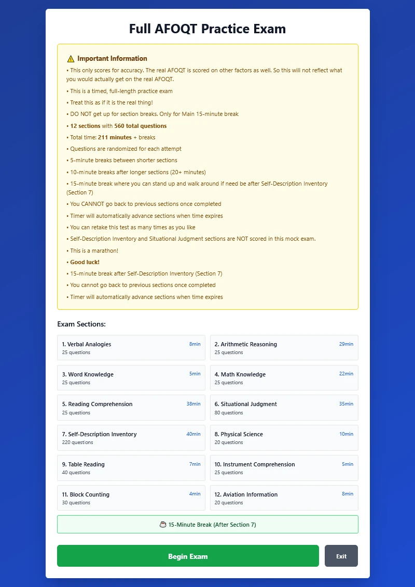
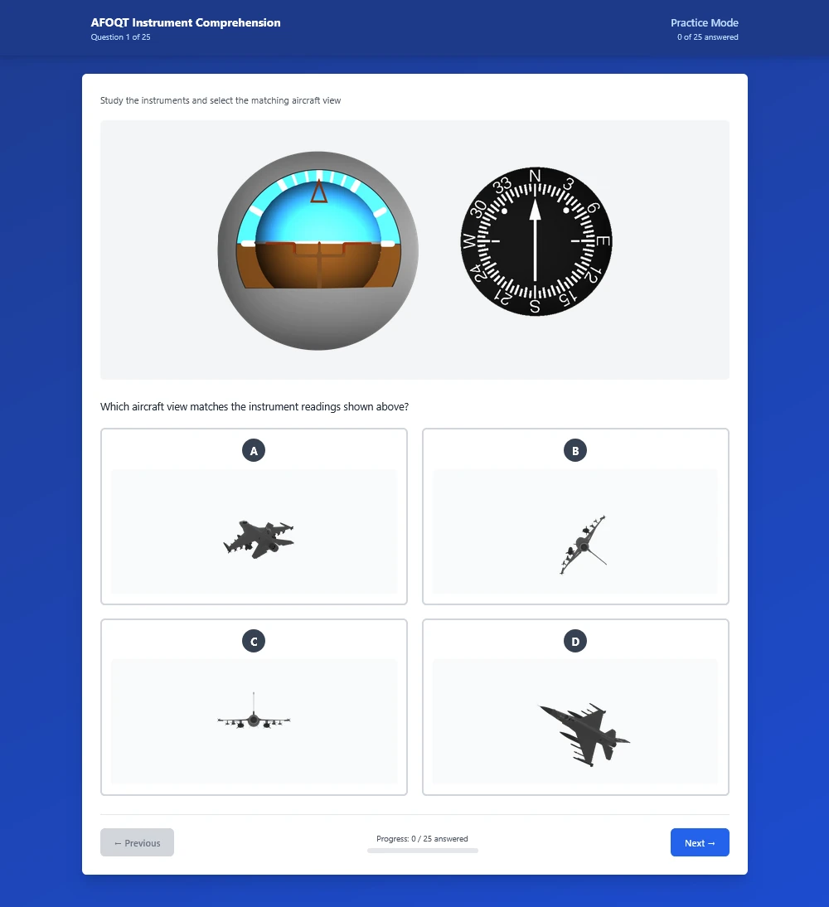
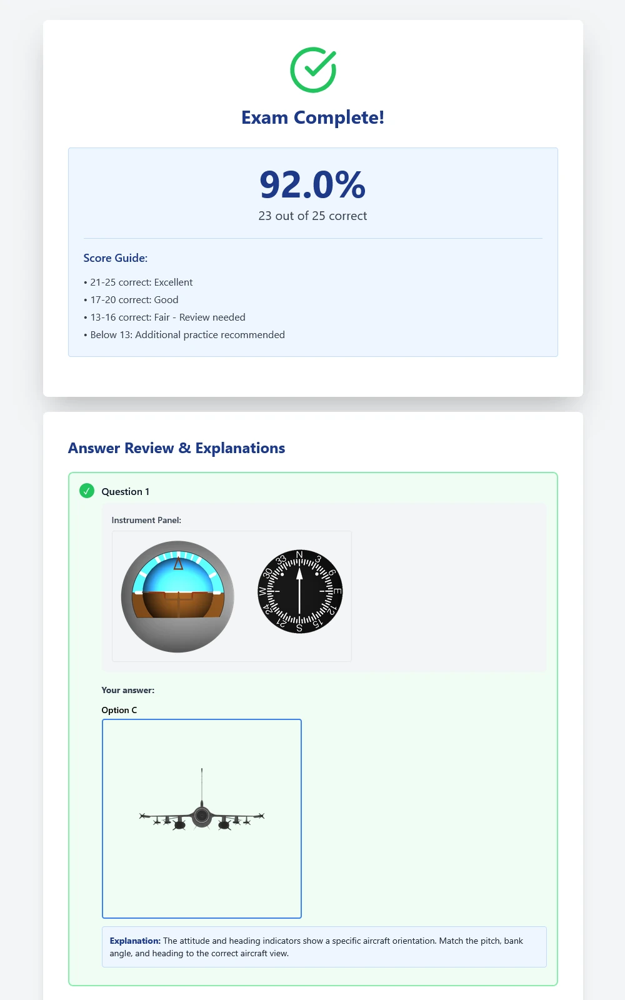

# AFOQT Mock Exam

A comprehensive practice examination application for the Air Force Officer Qualifying Test (AFOQT), built with React and hosted on GitHub Pages.

**Created by Jason J. Whitby**


## 🎯 Purpose

This application provides a realistic practice environment for individuals preparing for the AFOQT. It includes all 12 test sections with hundreds of practice questions, timed exams, and detailed explanations.

## ⚠️ Important Disclaimer

**This is NOT an official Air Force product.** This practice exam is:
- ❌ NOT affiliated with the United States Air Force
- ❌ NOT endorsed by the Department of Defense
- ❌ NOT a guarantee of passing scores or military acceptance
- ✅ An independent educational tool for practice purposes only

For official AFOQT information, visit [airforce.com](https://www.airforce.com) or contact your local recruiter.

## 📚 Features

### Test Sections
- **Verbal Analogies** (25 questions, 8 minutes)
- **Arithmetic Reasoning** (25 questions, 29 minutes)
- **Word Knowledge** (25 questions, 5 minutes)
- **Math Knowledge** (25 questions, 22 minutes)
- **Reading Comprehension** (25 questions, 38 minutes)
- **Situational Judgment** (50 scenarios, 35 minutes)
- **Self-Description Inventory** (220 statements, 40 minutes)
- **Physical Science** (20 questions, 10 minutes)
- **Table Reading** (40 questions, 7 minutes)
- **Instrument Comprehension** (25 questions, 5 minutes)
- **Block Counting** (30 questions, 4.5 minutes)
- **Aviation Information** (20 questions, 8 minutes)

### Practice Modes

#### 📖 Practice Mode
- Access individual sections
- Subsections with 25-40 questions each
- Untimed practice
- Immediate feedback with explanations
- Review answers and explanations

#### ⏱️ Full Exam Mode
- Complete 12-section exam experience
- Realistic timing for each section
- Randomized questions (different each attempt)
- Scheduled breaks (5, 10, and 15-minute breaks)
- Comprehensive results with detailed review

### Additional Features
- **550+ practice questions** across all sections
- **Visual diagrams** for geometry and instrument comprehension
- **Interactive tables** for table reading section
- **Progress tracking** during exams
- **Responsive design** for desktop and mobile
- **No login required** - instant access

## 🚀 Live Application

**Access the application here:** [AFOQT Mock Exam](https://735783d.github.io/afoqt-mock-exam/)

No installation required - just click and start practicing!

## 🛠️ Technology Stack

- **Frontend**: React 18.x
- **Styling**: Tailwind CSS
- **Icons**: Lucide React
- **Hosting**: GitHub Pages
- **Build Tool**: Create React App

## 📁 Project Structure

```
afoqt-mock-exam/
├── public/
│   └── images/           # Image assets for questions
│       ├── instruments/  # Instrument comprehension diagrams
│       └── blocks/       # Block counting diagrams
├── src/
│   ├── components/       # React components
│   │   ├── ExamQuestion.js
│   │   ├── ExamResults.js
│   │   ├── MathDiagrams.js
│   │   └── ...
│   ├── data/            # Question banks
│   │   ├── arithmeticQuestions.js
│   │   ├── mathKnowledgeQuestions.js
│   │   └── ...
│   ├── modes/           # Exam modes
│   │   ├── PracticeMode.js
│   │   └── FullExamMode.js
│   ├── utils/           # Utility functions
│   └── styles/          # CSS files
└── package.json
```

## 🎖️ About the Developer

**Jason J. Whitby** - Developer & Creator

This application was developed to demonstrate technical proficiency and provide a valuable resource for individuals preparing for Air Force officer commissioning. The project showcases:

### Technical Skills Demonstrated
- **Full-Stack Web Development**: React 18.x, JavaScript ES6+, modern web technologies
- **3D Modeling & Rendering**: Created 1000+ original diagrams using Blender for Instrument Comprehension and Block Counting sections
- **Data Architecture**: Designed and implemented question banks with 550+ practice questions across 12 test sections
- **Algorithm Development**: Built randomization algorithms, scoring systems, and timing logic for realistic exam simulation
- **User Experience Design**: Responsive interface supporting both practice and full exam modes with intuitive navigation
- **Project Management**: Comprehensive documentation, version control, and deployment pipeline

### Project Scope
- **600+ hours** of development time
- **550+ original questions** with detailed explanations
- **500+ 3D-rendered images** for visual question types
- **12 complete test sections** matching official AFOQT structure
- **Responsive design** for desktop and mobile devices

This project represents a commitment to excellence and a dedication to helping future Air Force officers succeed in their commissioning journey.

## 🎨 Screenshots

### Landing Page


### Practice Mode


### Full Exam Mode


### Instrument Comprehension


### Results & Review


## 📝 Question Data

All questions are stored in JavaScript files in the `src/data/` directory. Each question includes:
- Question text
- Multiple choice options
- Correct answer index
- Detailed explanation
- Optional diagrams/visuals

### Data Format Example

```javascript
{
  id: 1,
  text: "What is 2 + 2?",
  options: ["3", "4", "5", "6"],
  correct: 1,
  explanation: "2 + 2 = 4"
}
```

## 🤝 Contributing

This is a personal project and the source code is proprietary. While the application is freely available for use, the codebase is not open for contributions or forks without permission.

**However**, if you find bugs or have suggestions, please feel free to open an issue!

## 📜 License & Copyright

**© 2025 Jason J. Whitby. All Rights Reserved.**

### Usage Rights
- ✅ **Free to use** the live application at the hosted URL
- ✅ **Free to view** the source code for educational purposes
- ✅ **Free to learn** from the implementation

### Restrictions
- ❌ **May NOT copy** the source code for commercial or personal projects
- ❌ **May NOT redistribute** or republish this code
- ❌ **May NOT claim** this work as your own
- ❌ **May NOT create** derivative works without explicit written permission

### Contact for Permissions
If you wish to use portions of this code in your own project, please open an issue on GitHub to request permission.

**Attribution Required**: Any permitted use must clearly credit Jason J. Whitby and link back to this repository.

## ⚖️ Legal

### Copyright Notice
© 2025 Jason J. Whitby. All rights reserved.

### Fair Use Statement
This application uses publicly available information about the AFOQT format and structure. No actual AFOQT test questions are reproduced. All practice questions are original content created for educational purposes.

### Image Assets
- Instrument comprehension diagrams: Original 3D renders created in Blender
- Block counting diagrams: Original 3D renders created in Blender
- All visual assets are original work

## 🙏 Acknowledgments

- Built with Create React App
- Icons by Lucide
- Styling with Tailwind CSS
- Hosted on GitHub Pages

## 📧 Contact

**Developer**: Jason J. Whitby  
**GitHub**: [@735783D](https://github.com/735783D)

For questions, feedback, or permission requests, please open an issue on GitHub.

## 🔗 Useful Resources

- [Official Air Force Website](https://www.airforce.com)
- [AFOQT Study Guide (Official)](https://www.airforce.com/how-to-join/prepare-for-success/afoqt)
- [Air Force Officer Training School](https://www.airforce.com/education/officer/ots)

---

**Remember**: This is a practice tool only. Always consult official Air Force resources for accurate, up-to-date information about the AFOQT and military service requirements.

**Good luck with your preparation! 🎖️**